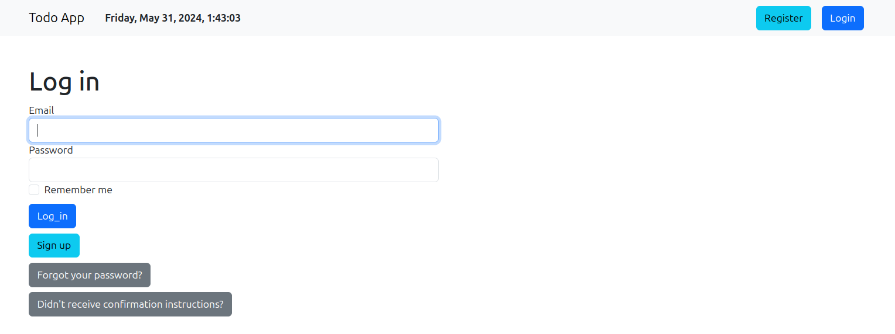

### Steps to follow for setup
  1. Get code
  3. Run `bundle install` to install all Gems from Gemfile
  4. Run `rails db:migrate` for run migrations
  5. Run Server `rails server`
  6. Visit [localhost:3000](http://127.0.0.1:3000) 

After Visting [localhost:3000](http://127.0.0.1:3000) 
  1. Sign-up 
  2. Go on server logs and find confirmation link and open it to confirm user. It looks something like this:
    
  3. Login
---

### Forgot/Reset password flow
  1. Go on login page 
  2. Click on Forgot password button
  3. Enter your email and click on **Send me reset password instructions**
  4. Go on server logs and find password reset link and open it to reset password. it looks something like this:
    

### Testing 
- Run unit tests with `bundle exec rspec`

---

### Features

  1. Sign up with confirmation link
  2. Edit user page to edit name, email and password
  3. Forget your password flow with confirmation link
  3. Each User has personal Todos
  4. Add Todos
  5. Edit Todos
  6. Update Todos
  7. Delete todo
  8. Complete and un-complete todos
  9. Not completed Todos past the due date becomes red
  10. All todo operations use Turbo Frames and Stimulus for achieve a single-page experience.
  
---

### Versions and Setup Guides:

* Rails version: 7.1.3

* Ruby version: ruby 3.2.3

* Bootstrap 5 for style

* [I followed this article for adding Bootstrap 5 in Rails 7](https://medium.com/@pietropugliesi/javascript-bootstrap-asset-bundling-in-ruby-on-rails-7-3640a220f2ce)

* Used Devise Gem for authentication, for more info see [Devise on Github](https://github.com/heartcombo/devise)

* Used Stimulus and Turbo Frames to achieve a single-page experience for adding, editing, and deleting tasks.

* Used RSpec for Unit tests

---

#### For more info / suggestions, please contact me on:
- My Email: <a href="mailto:ramgopalsiddh.000@gmail.com"> ramgopalsiddh.000@gmail.com</a>
- My Twitter :- <a href="https://twitter.com/ramgopalsiddh1/"> @ramgopalsiddh1</a>
- Linkedin :- <a href="https://www.linkedin.com/in/ramgopalsiddh/"> Linkedin/ramgopalsiddh </a>
- Portfolio :- <a href="https://ramgopal.dev/">ramgopal.dev</a>

---
## Screenshots

#### sign up

#### Resend Confirmation

#### Forgot(Reset) password

#### Login Form

#### Edit User

#### Home page after login

#### Edit todo(task)
